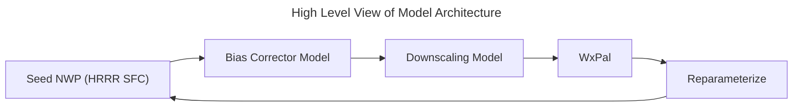
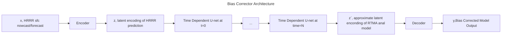
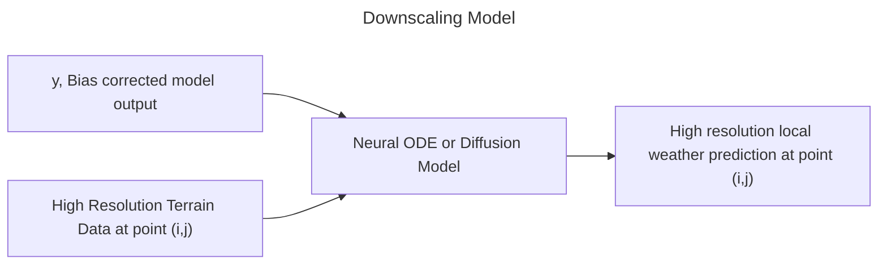

# Paladin-ML-Model

## Introduction

  We set out to provide real-time, downscaled weather nowcasts and predictions from NWP seed data by implementing two machine learning models: one to correct systematic bias at NWP model scale and a second to perform downscaling. Unlike previous works that apply Machine Learning to solve global and local scale weather predictions[1,2,3], we propose a lightweight architecture designed to work within existing NWP models rather than as an end to end solution. By dividing training two specialist models, we aim to ease learning and reduce model complexity. 

## Background

  It is extremely useful in many fields to be able to have access to high-spatial and temporal resolution weather predictions. Due to computational cost, we cannot run NWP models at higher resolutions and have results available in a timeframe where they are still useful for making meteorlogical predictions. Therefore, we turn to deep learning models to learn the task of downsampling Seed Model outputs. Previous work in this field has leveraged GANs [2,3] coupled with high resolution precipitation datasets, and deep convolutional networks coupled with high resolution synnthetic data to produce high resolution predictions. In California and much of CONUS, we lack dense high resolution measurements from local weather stations (ie to have the large amounts of data to train a generative model, such as a GAN, directly). Furthermore, we don't want to learn the distribution of a numerical solution to the underlying fluid dynamics in question. In this same vain, we also do not want our downscaling model to be dependent on the biases of our seed model. Therefore, we turn to a novel approach where we propose a model to perform downsampling on geographically sparse data in a way which is decoupled from the seed model's biases. 

At the highest level, we propose the following architecture:

In the first model, we aim to remove any systematic errors we find in the HRRR model. As the model is optimized to provide solutions which are generally accurate over CONUS, it is known that it can be fine tuned to provide solutions which are more accurate in specific geographic scenarios. Therefore, it is of great interest to consider a model which corrects for these errors. To seek out these errors, we use Real-Time Mesoscale Analysis data on a 2.5 km^2 grid as ground truth data and will leverage high (spatial) resolution terrain data to condition the model on. To accommplish this, we aim to train a variational autoencoder with latent dimension given by a downscaling factor 2^m which we will determine then we aim to perform the model correction in the latent space of this model space of this model using a time conditional u-net. 

## Architecture Specifics

We leverage the work of Latent Diffusion Models [4] with a time-conditioned U-net backbone [6] and variational autoencoders (VAEs) [5]  to build our bias correction model. 

We introduce a local downscaling method which aims to make high resolution weather predictions at a single point. To obtain a high spatial resolution, we simply run our model over a grid in parallel. We opt for this architecture due to the sparsity of high resolution ground truth data. 

## Bibliography

[1] @misc{cheon2024karinaefficientdeeplearning,
      title={KARINA: An Efficient Deep Learning Model for Global Weather Forecast}, 
      author={Minjong Cheon and Yo-Hwan Choi and Seon-Yu Kang and Yumi Choi and Jeong-Gil Lee and Daehyun Kang},
      year={2024},
      eprint={2403.10555},
      archivePrefix={arXiv},
      primaryClass={cs.LG},
      url={https://arxiv.org/abs/2403.10555}, 
}

[2] @misc{li2024generativeadversarialmodelsextreme,
      title={Generative Adversarial Models for Extreme Geospatial Downscaling}, 
      author={Guiye Li and Guofeng Cao},
      year={2024},
      eprint={2402.14049},
      archivePrefix={arXiv},
      primaryClass={cs.LG},
      url={https://arxiv.org/abs/2402.14049}, 
}
[3] @article{Harris_2022,
   title={A Generative Deep Learning Approach to Stochastic Downscaling of Precipitation Forecasts},
   volume={14},
   ISSN={1942-2466},
   url={http://dx.doi.org/10.1029/2022MS003120},
   DOI={10.1029/2022ms003120},
   number={10},
   journal={Journal of Advances in Modeling Earth Systems},
   publisher={American Geophysical Union (AGU)},
   author={Harris, Lucy and McRae, Andrew T. T. and Chantry, Matthew and Dueben, Peter D. and Palmer, Tim N.},
   year={2022},
   month=oct }

[4] @misc{rombach2022highresolutionimagesynthesislatent,
      title={High-Resolution Image Synthesis with Latent Diffusion Models}, 
      author={Robin Rombach and Andreas Blattmann and Dominik Lorenz and Patrick Esser and Björn Ommer},
      year={2022},
      eprint={2112.10752},
      archivePrefix={arXiv},
      primaryClass={cs.CV},
      url={https://arxiv.org/abs/2112.10752}, 
}

[5] @misc{kingma2022autoencodingvariationalbayes,
      title={Auto-Encoding Variational Bayes}, 
      author={Diederik P Kingma and Max Welling},
      year={2022},
      eprint={1312.6114},
      archivePrefix={arXiv},
      primaryClass={stat.ML},
      url={https://arxiv.org/abs/1312.6114}, 
}

[6] @misc{ronneberger2015unetconvolutionalnetworksbiomedical,
      title={U-Net: Convolutional Networks for Biomedical Image Segmentation}, 
      author={Olaf Ronneberger and Philipp Fischer and Thomas Brox},
      year={2015},
      eprint={1505.04597},
      archivePrefix={arXiv},
      primaryClass={cs.CV},
      url={https://arxiv.org/abs/1505.04597}, 
}

